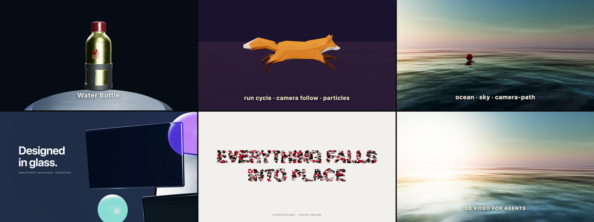

# stereoframe

**The auto-director for 3D motion graphics — drop in a GLB, get a cinematic reveal.**



```bash
npx stereoframe stage product.glb --preset reveal --title "Product"
cd product-reveal && npx stereoframe render   # → an Apple-ad-style reveal, zero hand-tuning
```

Asset generation (Meshy/Tripo/Rodin) is a solved, crowded space. The underserved, higher-value layer is **directing** a model — camera, lighting, timing, easing, staging — which is where motion designers actually spend their time. stereoframe auto-frames any model and applies a director preset (reveal / hero-orbit / turntable), all deterministic and agent-drivable. It's also a full declarative 3D-video framework underneath (below).

Describe a three.js scene, camera, lighting, and motion in plain HTML custom elements; render it frame-perfectly to MP4 with the bundled CLI. The thesis (borrowed from [HyperFrames](https://github.com/heygen-com/hyperframes), which proved it for 2D): LLMs write HTML fluently, so HTML is the right authoring surface for AI-generated video — stereoframe applies it to 3D.

```bash
npx stereoframe init my-video && cd my-video
npx stereoframe lint && npx stereoframe validate   # agent-grade verification
npx stereoframe render      # → renders/render_<ts>.mp4, bit-identical across runs
npx stereoframe preview     # looping playback in the browser
```

```html
<sf-scene environment="assets/studio.hdr" background="#0b0f17">
  <sf-camera fov="33" position="0 0.35 4.4" look-at="#product"></sf-camera>
  <sf-model id="product" src="assets/helmet.glb"></sf-model>
  <sf-light preset="studio"></sf-light>
  <sf-animate target="#product" verb="turntable" rpm="5"></sf-animate>
  <sf-animate target="camera" verb="orbit" around="#product"
              from="0deg" to="35deg" duration="8" ease="sine.inOut"></sf-animate>
</sf-scene>
```

## Generate assets from text

Need a model you don't have? `stereoframe gen` turns a prompt into a textured GLB (via [Meshy](https://www.meshy.ai)) and drops it in `assets/`:

```bash
stereoframe gen "a low-poly treasure chest"   # → assets/a-low-poly-treasure-chest.glb
# then: <sf-model src="assets/a-low-poly-treasure-chest.glb"></sf-model>
```

It runs with no setup using Meshy's free test mode (returns a sample model); set `MESHY_API_KEY` (shell env or project `.env`) for real prompt-driven generations.

## How it works

- **Seek-driven rendering.** The CLI drives the runtime's protocol (`window.__stereoframe.seek(t)`, `t = frame / fps`) in headless Chrome and screenshots each frame into ffmpeg. Every frame is a pure function of `t`: verb writers → `AnimationMixer.setTime(t)` → `camera.lookAt` → `renderer.render`. No wall clock, no `requestAnimationFrame`, no accumulated state.
- **Preload gate.** `__stereoframe.ready` only flips true after every GLB/HDRI is loaded and shaders are compiled — the renderer waits for it, so first frames are never half-loaded.
- **Semantic verbs.** `turntable`, `orbit`, `dolly`, `move`, `follow`, `crossfade-clip`, `bounce-in`, `fade-in`, `float` with GSAP-compatible easing names compile to pure analytic writers — idempotent, random-access seekable, unit-tested without a GPU.
- **Stateless particles.** `<sf-particles>` (fountain/snow/dust) computes every particle position in-shader as a closed-form function of seeded attributes and `t` — no simulation steps, bit-identical for a given seed.

- **Custom shaders via the escape hatch.** `<script type="stereoframe">` receives `sf` with the full `sf.THREE` namespace — write custom geometry/materials/GLSL (iridescent, marble, vertex-displaced morphs) that the markup can't express, add them to `sf.scene`, and drive uniforms from `sf.onSeek(t)`. Still deterministic and post-processed.
- **HyperFrames embed mode.** A composition with a `[data-composition-id]` root automatically behaves as a HyperFrames adapter instead (listens to `hf-seek`, gates `window.__hf` readiness) — use it when you want HyperFrames' 2D blocks, audio, and studio around your 3D scene.

## Repository layout

```
packages/runtime/    stereoframe-runtime → dist/stereoframe.js (three.js r184 bundled)
packages/cli/        stereoframe → `stereoframe` bin (stage/init/gen/lint/validate/render/preview/add/update)
examples/
  hello-standalone/        CLI-scaffolded starter (no HyperFrames)
  character-run-standalone/ Fox run cycle + follow cam + particles, own pipeline
  ocean-flythrough/        sf-sky + sf-ocean + camera-path golden-hour flight
  glass-hero/              transmission glass panels ("Designed in glass")
  paper-swarm/             sf-swarm typography choreography
  multi-shot/              16s three-shot trailer (swarm → glass → ocean, crossfades)
  variant-demo/            colorway switching with the variant verb
  metaball/                gooey blobs occluding typography (sf-metaball)
  hello-cube/              HyperFrames embed: raw three.js + hf-seek
  product-turntable/       HyperFrames embed: GLB + HDRI + verbs
  verbs-demo/              HyperFrames embed: six-verb rehearsal
  character-run/           HyperFrames embed: character demo
skills/stereoframe/  agent authoring guide (SKILL.md)
docs/format.md       markup specification
docs/prompting.md    how to request videos in natural language
docs/research/       foundation research (ecosystem, determinism, AI formats)
```

## Quick start (from this repo)

```bash
bun install && bun run build
node packages/cli/dist/cli.js init my-video
cd my-video && node ../packages/cli/dist/cli.js render
```

Requires Node ≥ 20, ffmpeg, and [bun](https://bun.sh) (for building).

## Status

v0 (Tier 3b+): standalone CLI pipeline (init/gen/lint/validate/render/preview/add/update, Puppeteer + ffmpeg), **text-to-3D asset generation** (`stereoframe gen` → textured GLB via Meshy), **3D-aware verification** (`lint`: markup/asset/time-purity static checks; `validate`: headless probes for lighting, framing, black frames, and seek idempotency — the determinism contract, machine-checked), **multi-shot compositions** (each sf-scene is a shot with cut/crossfade transitions and shot-local time), declarative scenes, GLB/HDRI preloading, eleven animation verbs incl. character clip crossfades, camera follow, `camera-path` spline flythroughs, and `variant` colorway switching, stateless GPU particles, visual blocks (`sf-sky`, `sf-ocean`, `sf-swarm` typography choreography, `sf-metaball` goo), glass/physical materials (transmission, rounded-box, emissive), **GLB auto-director** (`stage` command: auto-framing + reveal/hero-orbit/turntable presets), **compressed-GLB support** (Draco/KTX2/Meshopt, so real downloaded/generated models just load), **post-processing finish** (supersampling AA, procedural `environment="room"` reflections, bloom, vignette, grain, chromatic aberration — all deterministic), DOM title overlays, deterministic local renders (frame-hash-identical across runs). **custom shaders** via `sf.THREE` in the escape hatch, **matcap materials** (pearl/chrome/iridescent/clay/holo — designer-grade surfaces, no lighting), cinematic finish (**film grain, chromatic aberration, color grade** + bloom/vignette), and a **`sway`** secondary-motion verb. Determinism is scoped to seekability (structure), leaving visuals free. HyperFrames embed mode retained. Roadmap: depth of field + motion blur, audio mux, alpha output, Docker bit-parity CI.

## Releasing

`stereoframe` (CLI) and `stereoframe-runtime` are versioned lock-step; `bun run release` (patch by default) bumps both, publishes, and tags. See [VERSIONING.md](VERSIONING.md) for the bump policy.

## License

MIT.

Example assets: [Water Bottle](https://github.com/KhronosGroup/glTF-Sample-Models/tree/main/2.0/WaterBottle) (CC0), [Fox](https://github.com/KhronosGroup/glTF-Sample-Models/tree/main/2.0/Fox) by PixelMannen (model, CC0) & @tomkranis (rigging/animation, CC BY 4.0), HDRIs from [Poly Haven](https://polyhaven.com) (CC0), water normal map from [three.js](https://github.com/mrdoob/three.js) (MIT).
